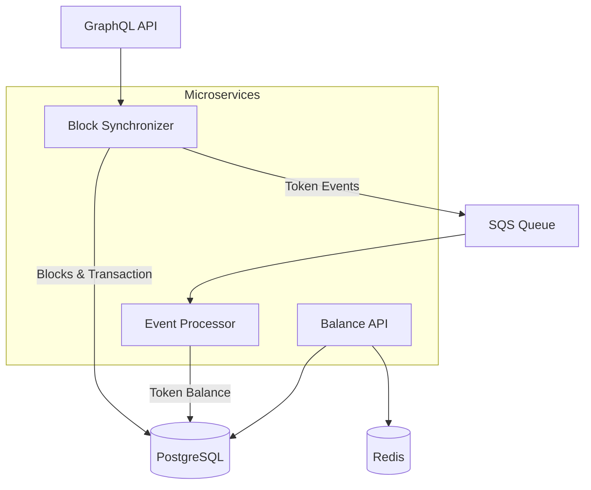

Gno.land Balance Indexer
===

A microservices-based indexer for tracking token balances on the [Gno.land](https://gno.land/) blockchain.

## Architecture



## Services

### Block Synchronizer
- Fetches blocks from GraphQL API
- Processes transactions and events
- Sends token events to SQS queue

### Event Processor
- Consumes token events from SQS
- Updates token balances in database
- Records transfer history

### Balance API
- REST API for querying token balances
- Provides transfer history endpoints
- Health check endpoint

## Quick Start

```bash
# Start all services
docker-compose up -d

# Get all token balances
curl http://localhost:8080/tokens/balances
```

## Development

### Prerequisites
- Go 1.21+
- Docker & Docker Compose

### Build and Test
```bash
make help

make test # Run all tests
make build # Build all services
make fmt # Format and lint code
make clean # Clean up
```

## API Endpoints

### Token Balances
```bash
# Get all token balances
GET /tokens/balances

# Get balances for specific address
GET /tokens/balances?address=g17290cwvmrapvp869xfnhhawa8sm9edpufzat7d
```

### Token Balances by Path
```bash
# Get all account balances for specific token
GET /tokens/gno.land/p/demo/grc/grc20/balances

# Get balance for specific token and address
GET /tokens/gno.land/p/demo/grc/grc20/balances?address=g17290cwvmrapvp869xfnhhawa8sm9edpufzat7d
```

### Transfer History
```bash
# Get all transfer history
GET /tokens/transfer-history

# Get transfer history for specific address
GET /tokens/transfer-history?address=g17290cwvmrapvp869xfnhhawa8sm9edpufzat7d
```

### Health Check
```bash
GET /health
